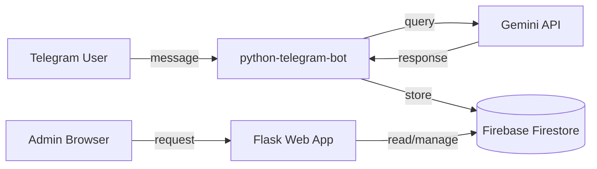

# EquityX AI Assistant

A web-based customer support platform for stock market education, built with Flask and integrated with Telegram. Users interact through a Telegram chatbot that answers trading-related queries using the Gemini API, while administrators manage users, conversations, feedback, and support tickets through a web dashboard.

Developed as the final-year MCA project by **Manali Solanki** (Master of Computer Applications — AI & ML).

---

## Features

**User-facing (Telegram Bot)**

- Account registration and onboarding via Telegram commands
- Conversational Q&A on trading, investing, technical analysis, and risk management
- Feedback submission and support ticket creation directly from chat

**Admin Dashboard (Web)**

- Authenticated admin panel with login protection
- User management — view registered Telegram users
- Chat history — search and review all conversations, delete individual records
- Feedback and support ticket management
- Analytics — per-user chat statistics visualised with Chart.js

---

## Architecture



The application runs two services in parallel threads:

1. **Telegram bot** — polls for messages and commands using `python-telegram-bot`
2. **Flask server** — serves the admin dashboard and handles authentication via `flask-login`

Both services share a single Firestore database for users, chat history, feedback, and support tickets.

---

## Tech Stack

| Layer          | Technology                           |
| -------------- | ------------------------------------ |
| Bot framework  | python-telegram-bot 22.7             |
| AI backend     | Google Gemini 2.5 Flash via genai    |
| Web framework  | Flask 3.1                            |
| Database       | Firebase Firestore                   |
| Authentication | Flask-Login, environment credentials |
| Frontend       | HTML5, CSS3, Bootstrap, Chart.js     |
| Deployment     | Render (see `render.yaml`)           |

---

## Project Structure

```
EquityX-AI-Assistant/
├── app.py                     # Entry point — Flask app + Telegram bot
├── chatbot/
│   ├── ai_handler.py          # Gemini API integration
│   └── bot.py                 # Bot module
├── database/
│   ├── firebase_config.py     # Firestore initialisation
│   ├── user_service.py        # User CRUD operations
│   ├── chat_service.py        # Chat history storage and statistics
│   ├── feedback_service.py    # Feedback persistence
│   └── support_service.py     # Support ticket management
├── admin/
│   └── routes.py              # Admin route definitions
├── templates/
│   ├── index.html             # Landing page
│   ├── dashboard.html         # User dashboard
│   └── admin/                 # Admin panel templates
│       ├── base.html
│       ├── login.html
│       ├── dashboard.html
│       ├── users.html
│       ├── chats.html
│       ├── feedbacks.html
│       ├── support.html
│       └── analytics.html
├── static/
│   └── style.css
├── requirements.txt
├── render.yaml                # Render deployment config
└── .env                       # Environment variables (not tracked)
```

---

## Setup

### Prerequisites

- Python 3.10+
- A Firebase project with Firestore enabled
- A Telegram bot token (from [@BotFather](https://t.me/BotFather))
- A Google Gemini API key

### Installation

```bash
git clone https://github.com/your-username/EquityX-AI-Assistant.git
cd EquityX-AI-Assistant

python -m venv .venv
source .venv/bin/activate        # Windows: .venv\Scripts\activate

pip install -r requirements.txt
```

### Configuration

Create a `.env` file in the project root:

```env
SECRET_KEY=your_flask_secret_key
BOT_TOKEN=your_telegram_bot_token
GEMINI_API_KEY=your_gemini_api_key
ADMIN_USERNAME=admin
ADMIN_PASSWORD=your_admin_password
FIREBASE_CREDENTIALS={"type":"service_account", ...}
```

Alternatively, place your Firebase service account JSON file in the project directory and update the filename in `database/firebase_config.py`.

### Running

```bash
python app.py
```

This starts both the Telegram bot (polling) and the Flask admin dashboard on `http://localhost:5050`.

---

## API Endpoints

| Method | Endpoint            | Description               | Auth   |
| ------ | ------------------- | ------------------------- | ------ |
| GET    | `/`                 | Health check              | Public |
| GET    | `/login`            | Admin login page          | Public |
| POST   | `/login`            | Admin authentication      | Public |
| GET    | `/admin/dashboard`  | Dashboard with statistics | Admin  |
| GET    | `/admin/users`      | Registered users list     | Admin  |
| GET    | `/admin/chats`      | Chat history (searchable) | Admin  |
| GET    | `/delete-chat/<id>` | Delete a chat record      | Admin  |
| GET    | `/admin/feedbacks`  | User feedback list        | Admin  |
| GET    | `/admin/support`    | Support tickets           | Admin  |
| GET    | `/admin/analytics`  | Chat analytics charts     | Admin  |

---

## Database Schema (Firestore)

### `users`

| Field      | Type     | Description            |
| ---------- | -------- | ---------------------- |
| user_id    | Integer  | Telegram user ID       |
| username   | String   | Telegram username      |
| first_name | String   | User's first name      |
| joined_at  | Datetime | Registration timestamp |

### `chat_history`

| Field     | Type     | Description            |
| --------- | -------- | ---------------------- |
| user_id   | Integer  | Telegram user ID       |
| username  | String   | Telegram username      |
| message   | String   | User's message         |
| response  | String   | Generated response     |
| timestamp | Datetime | Conversation timestamp |

### `feedbacks`

| Field      | Type     | Description          |
| ---------- | -------- | -------------------- |
| user_id    | Integer  | Telegram user ID     |
| username   | String   | Telegram username    |
| feedback   | String   | Feedback text        |
| created_at | Datetime | Submission timestamp |

### `support_tickets`

| Field      | Type     | Description          |
| ---------- | -------- | -------------------- |
| user_id    | Integer  | Telegram user ID     |
| username   | String   | Telegram username    |
| issue      | String   | Issue description    |
| status     | String   | Ticket status (Open) |
| created_at | Datetime | Creation timestamp   |

---

## Telegram Bot Commands

| Command     | Description                      |
| ----------- | -------------------------------- |
| `/start`    | Welcome message and command list |
| `/about`    | Platform information             |
| `/services` | Available services               |
| `/courses`  | Course catalogue                 |
| `/kyc`      | KYC document requirements        |
| `/contact`  | Contact details                  |
| `/register` | Registration instructions        |
| `/support`  | Create a support ticket          |
| `/feedback` | Submit feedback                  |

Any non-command message is processed as a trading/investing query and answered using Gemini.

---

## Deployment

The project includes a `render.yaml` for deployment on [Render](https://render.com):

services:

- type: web
  name: EquityX AI Assistant
  env: python
  buildCommand: pip install -r requirements.txt
  startCommand: python app.py

Set all environment variables from the Configuration section in the Render dashboard.

**Live instance:** https://equityx-ai-assistant.onrender.com

---

## Screenshots

### Landing Page


### Admin Login


### Admin Dashboard


### User Management


### Chat History


### Feedback Management


### Support Tickets


### Analytics Dashboard


### Telegram Bot Integration


## Live Demo

https://drive.google.com/drive/folders/1UL0H__Wrutp6L8GjRMHJV0-2OIeEsYjk

---

## Author

Manali Solanki

Master of Computer Applications (Artificial Intelligence & Machine Learning)

Developed as the final-year MCA major project, showcasing advanced software development and AI application skills.
